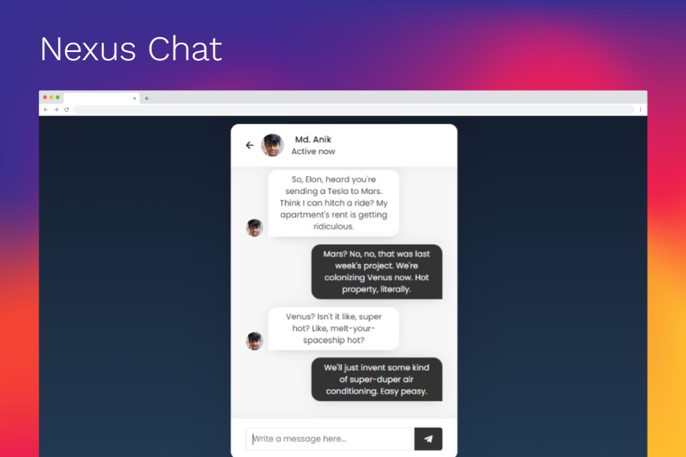
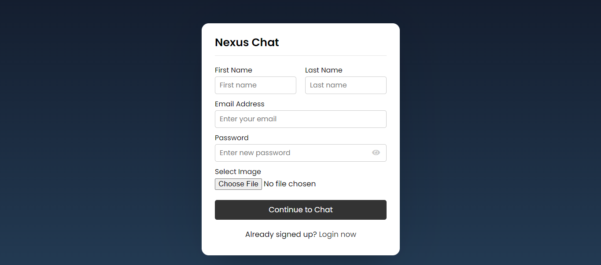
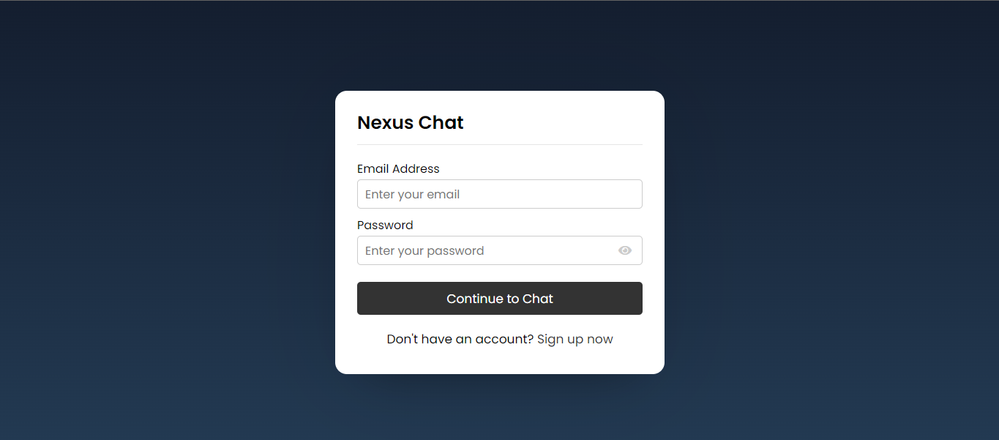
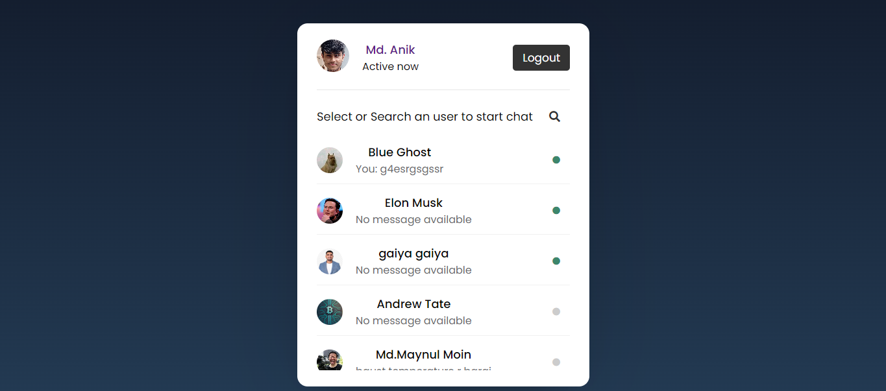
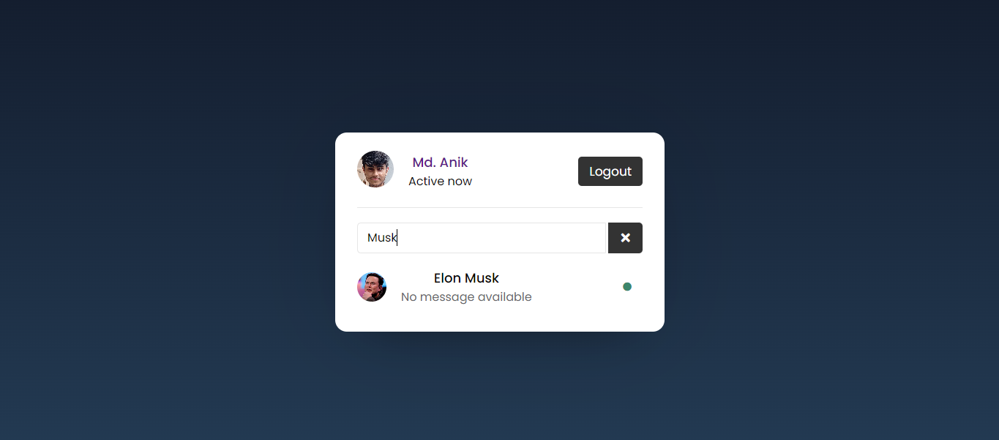
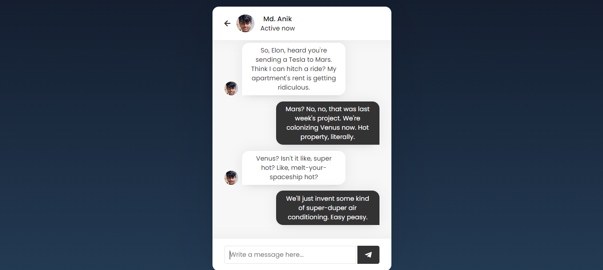

# Nexus Chat

Nexus Chat is a web-based chat application developed using JavaScript for client-side functionality and MySQL and PHP for server-side operations.

## Features

- User authentication and registration
- User search functionality
- Real-time chat functionality
- Persistent message storage in MySQL database
- Responsive design for seamless usage across devices

## Screenshots







## Demo

Check out the live demo of Nexus Chat [here](https://nexuschat.000webhostapp.com/).

## Installation

To run the application locally:

1. Clone this repository: `git clone https://github.com/duskdev17/nexus-chat.git`

2. Set up your MySQL database:
   - Create a database named `chatapp`
   - Import the SQL schema from `backup/chatapp.sql`

3. Update the database connection details in `php/config.php` if needed:
   ```php
   $hostname = "localhost";
   $username = "root";
   $password = "";
   $dbname = "chatapp";
   ```

4. Start a local server or use a tool like XAMPP to serve the PHP files.

5. Open `index.php` in your web browser.

## Technologies Used

- JavaScript
- HTML
- CSS
- PHP
- MySQL
- AJAX
- Other dependencies...

## Contributing

Contributions are welcome! Feel free to submit pull requests or open issues if you encounter any bugs or have suggestions for improvements.

## License

This project is licensed under the MIT License - see the [LICENSE](LICENSE) file for details.
